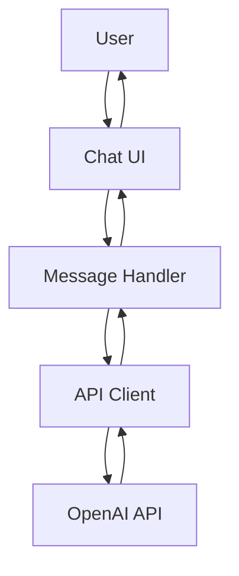

# AI Chatbot Architecture Plan

## Overview
This plan outlines the architecture for an AI chatbot similar to ChatGPT, built as a web application. The chatbot allows users to send messages and receive AI-generated responses with streaming support.

## High-Level Requirements
- User can input text messages
- Messages are sent to an AI API (OpenAI ChatGPT)
- Responses are displayed in real-time with streaming
- Simple, responsive chat interface
- No user authentication or persistent history in this basic version

## Selected Technologies
- **Frontend**: Vanilla HTML, CSS, JavaScript
- **API Integration**: OpenAI ChatGPT API via HTTP fetch with streaming
- **No backend server**: Client-side only (note: may require a proxy for CORS if deploying)

## Project Structure
```
ai-chatbot/
├── index.html          # Main HTML file
├── css/
│   └── styles.css      # Styles for the chat interface
├── js/
│   ├── app.js          # Main application logic
│   ├── api.js          # API interaction module
│   └── ui.js           # UI manipulation module
└── README.md           # Project documentation
```

## Key Components
1. **Chat User Interface (UI)**:
   - Message display area (scrollable)
   - Input field for user messages
   - Send button
   - Loading indicator for streaming responses

2. **Message Handling Logic**:
   - Capture user input
   - Append user messages to chat
   - Trigger API call
   - Handle incoming streamed response chunks
   - Append AI responses to chat

3. **API Interaction**:
   - Send POST requests to OpenAI API
   - Handle streaming responses using fetch API
   - Parse JSON chunks for content
   - Error handling for API failures

## Libraries and Frameworks
- None required (vanilla JS)
- Optional: Consider a lightweight library like Axios if fetch becomes complex, but not necessary for basic implementation

## Detailed Specification

### UI Component Details
- **Chat Container**: A div with fixed height, overflow scroll
- **Message Bubbles**: User messages right-aligned, AI messages left-aligned
- **Input Area**: Textarea or input with send button
- **Streaming Indicator**: Show "AI is typing..." during streaming

### API Integration Details
- Use OpenAI's `/v1/chat/completions` endpoint
- Set `stream: true` in request body
- Handle Server-Sent Events (SSE) from response
- Parse `data: {...}` lines for content
- Append content incrementally to UI

### Message Handling
- Store messages in an array for context (up to a limit)
- Send conversation history with each API call
- Clear input after sending

### Error Handling
- Display error messages in chat if API fails
- Handle network errors, rate limits, etc.

## System Architecture Diagram



## Implementation Notes
- Ensure API key is handled securely (e.g., environment variables if backend added later)
- For production, consider adding a backend proxy to hide API key
- Test with OpenAI's free tier or sandbox
- Responsive design for mobile devices

## Next Steps
This plan provides a foundation for implementation. Review and approve to proceed with coding.