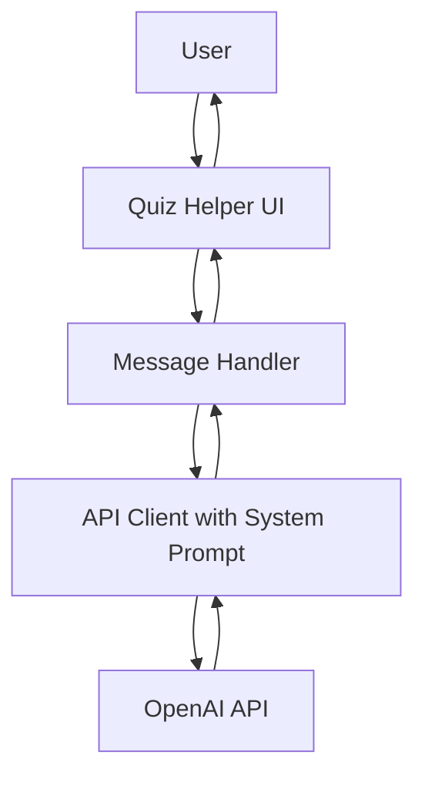

# AI Quiz Helper Architecture Plan

## Overview
This plan outlines the adaptation of the existing AI chatbot into an AI Quiz Helper that assists users during online tests and quizzes. The helper will provide hints, explanations, and answers to quiz-related questions using OpenAI's GPT model.

## High-Level Requirements
- Users can ask questions related to quizzes or tests.
- AI provides helpful responses, such as hints, explanations, or direct answers (with caution for academic integrity).
- Simple chat interface similar to the existing chatbot.
- Subject selection to tailor responses to specific topics (e.g., Math, Science, History).
- No authentication or persistent history.

## Selected Technologies
- **Frontend**: Vanilla HTML, CSS, JavaScript (same as existing).
- **API Integration**: OpenAI ChatGPT API with modified prompts.
- Client-side only.

## Project Structure
Reuse the existing ai-chatbot structure, with modifications to app.js and index.html.

## Key Components
1. **Chat UI**: Same as existing, but updated labels.
2. **Message Handling**: Include system prompt in API calls to guide AI behavior.
3. **API Interaction**: Modified to send system message for quiz assistance.

## Modifications Needed
- **app.js**: Add system message to the messages array in getAIResponse, and update it based on selected subject.
- **index.html**: Update title, header, and placeholder messages to reflect quiz helper theme. Add a subject selection dropdown.
- **css/styles.css**: Ensure styling for the new dropdown.

## System Prompt Example
"You are a helpful AI assistant for online quizzes and tests. Provide hints, explanations, and answers to questions. Be accurate and educational."

## Implementation Notes
- Ensure responses are helpful but encourage learning.
- Test with various quiz questions.
- For production, consider ethical implications.

## Architecture Diagram

## Next Steps
Review this plan. If approved, proceed to implementation in code mode.